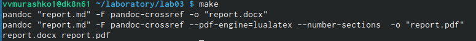

---
## Front matter
lang: ru-RU
title: Markdown
author:
       Мурашко В.В.
date: 29.04.2021

## Formatting
toc: false
slide_level: 2
theme: metropolis
header-includes: 
 - \metroset{progressbar=frametitle,sectionpage=progressbar,numbering=fraction}
 - '\makeatletter'
 - '\beamer@ignorenonframefalse'
 - '\makeatother'
aspectratio: 43
section-titles: true
---

# Отчёт по лабораторной работе №3

## Цели

Научиться оформлять отчёты с помощью легковесного языка разметки Markdown.

## Создание markdown по шаблону
Я сделала отчёт по предыдущей лабораторной работе в формате Markdown.

{ #fig:001 width=70% }

## Работа с консолью
С помощью команды make я отформатировала наш файл в форматах docx и pdf.

{ #fig:001 width=70% }

## Создание отчёта в 3 форматах (pdf)

{ #fig:001 width=70% }

## Создание отчёта в 3 форматах (docx)

{ #fig:001 width=70% }

## Создание отчёта в 3 форматах (md)

{ #fig:001 width=70% }

## Вывод
Я научилась оформлять отчёты с помощью легковесного языка разметки Markdown.

