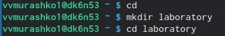

---
# Front matter
lang: ru-RU
title: "Отчёт по лабораторной работе №2"
subtitle: "Управление версиями"
author: "Мурашко Виктория Витальевна"

# Formatting
toc-title: "Содержание"
toc: true # Table of contents
toc_depth: 2
lof: true # List of figures
lot: true # List of tables
fontsize: 12pt
linestretch: 1.5
papersize: a4paper
documentclass: scrreprt
polyglossia-lang: russian
polyglossia-otherlangs: english
mainfont: PT Serif
romanfont: PT Serif
sansfont: PT Sans
monofont: PT Mono
mainfontoptions: Ligatures=TeX
romanfontoptions: Ligatures=TeX
sansfontoptions: Ligatures=TeX,Scale=MatchLowercase
monofontoptions: Scale=MatchLowercase
indent: true
pdf-engine: lualatex
header-includes:
  - \linepenalty=10 # the penalty added to the badness of each line within a paragraph (no associated penalty node) Increasing the value makes tex try to have fewer lines in the paragraph.
  - \interlinepenalty=0 # value of the penalty (node) added after each line of a paragraph.
  - \hyphenpenalty=50 # the penalty for line breaking at an automatically inserted hyphen
  - \exhyphenpenalty=50 # the penalty for line breaking at an explicit hyphen
  - \binoppenalty=700 # the penalty for breaking a line at a binary operator
  - \relpenalty=500 # the penalty for breaking a line at a relation
  - \clubpenalty=150 # extra penalty for breaking after first line of a paragraph
  - \widowpenalty=150 # extra penalty for breaking before last line of a paragraph
  - \displaywidowpenalty=50 # extra penalty for breaking before last line before a display math
  - \brokenpenalty=100 # extra penalty for page breaking after a hyphenated line
  - \predisplaypenalty=10000 # penalty for breaking before a display
  - \postdisplaypenalty=0 # penalty for breaking after a display
  - \floatingpenalty = 20000 # penalty for splitting an insertion (can only be split footnote in standard LaTeX)
  - \raggedbottom # or \flushbottom
  - \usepackage{float} # keep figures where there are in the text
  - \floatplacement{figure}{H} # keep figures where there are in the text
---

# Цель работы

Изучить идеологию и применение средств контроля версий.

# Задание

1. Настройка git
2. Подключение репозитория к github
3. Первичная конфигурация
4. Конфигурация git-flow

# Выполнение лабораторной работы

## Настройка git

Создаём учётную запись на github:
{ #fig:001 width=70% }

Настраиваем систему контроля версий git: для этого генерирум ключ с помощью команды ssh-keygen -C «Имя Фамилия <work@mail>», загружаем сгенерённый ключ на github, далее, скопировав из локальной консоли ключ в буфер обмена с помощью команды cat ~/.ssh/id_rsa.pub | xclip -sel clip, вставляем ключ в появившееся на сайте поле.
{ #fig:001 width=70% }
{ #fig:001 width=70% }

## Подключение репозитория к github

Создаём репозиторий на github:
{ #fig:001 width=70% }

Переходим в рабочий каталог laboratory:
{ #fig:001 width=70% }

Инициализируем системы git:
{ #fig:001 width=70% }

Создаём заготовку для файла README.md:
{ #fig:001 width=70% }

Делаем первый коммит и выкладываем на github:
{ #fig:001 width=70% }

## Первичная конфигурация

Добавим файл лицензии:
{ #fig:001 width=70% }

Добавим шаблон игнорируемых файлов и просмотрим список имеющихся шаблонов:
{ #fig:001 width=70% }

Затем скачаем шаблон:
{ #fig:001 width=70% }

Добавим новые файлы:
{ #fig:001 width=70% }

Выполним коммит:
{ #fig:001 width=70% }

Отправим на github:
{ #fig:001 width=70% }

## Конфигурация git-flow

Инициализируем git-flow:
{ #fig:001 width=70% }

Проверим, что мы на ветке develop:
{ #fig:001 width=70% }

Создадим релиз с версией 1.0.0:
{ #fig:001 width=70% }

Запишем версию:
{ #fig:001 width=70% }

Добавим в индекс:
{ #fig:001 width=70% }

Зальём релизную ветку в основную ветку:
{ #fig:001 width=70% }

Отправим данные на github:
{ #fig:001 width=70% }

Создадим релиз на github:
{ #fig:001 width=70% }

# Выводы

Я изучила идеологию и применение средств контроля версий, научилась генерировать ключи и подключать репозиторий.
