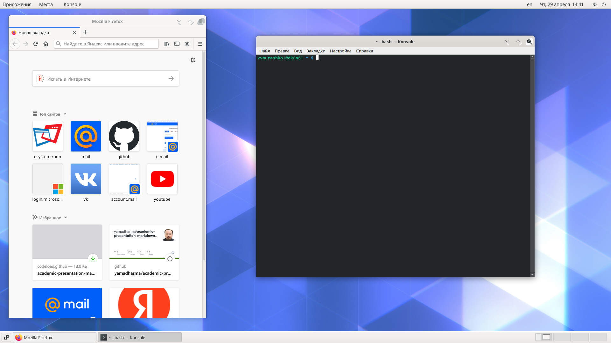
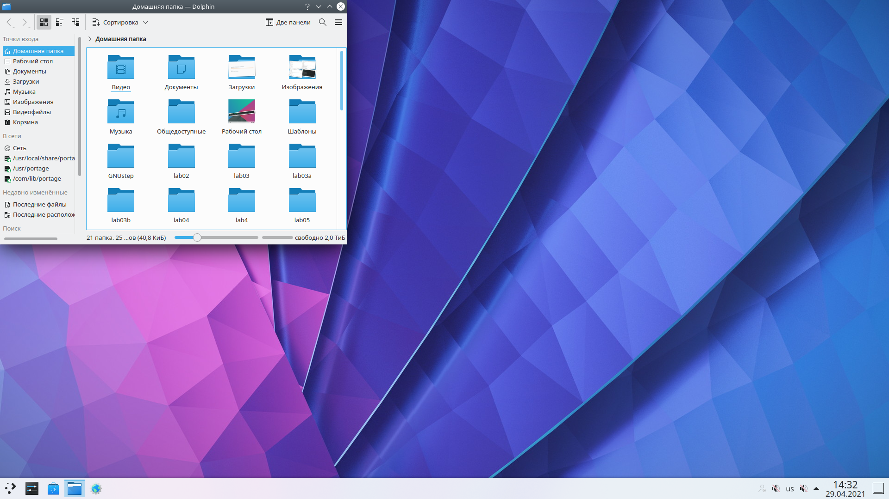
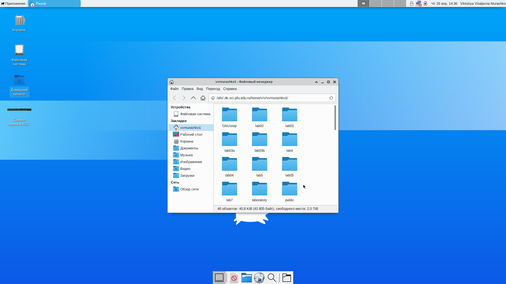
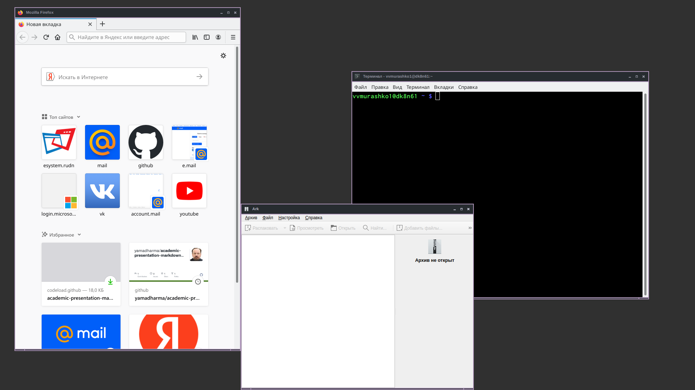

---
## Front matter
lang: ru-RU
title: Знакомство с операционной системой Linux
author:
       Мурашко В.В.
date: 29.04.2002
## Formatting
toc: false
slide_level: 2
theme: metropolis
header-includes: 
 - \metroset{progressbar=frametitle,sectionpage=progressbar,numbering=fraction}
 - '\makeatletter'
 - '\beamer@ignorenonframefalse'
 - '\makeatother'
aspectratio: 43
section-titles: true
---

# Отчёт по лабораторной работе №4

## Ход работы
1. Я ознакомилась с теоретическим материалом.
2. Я загрузила компьютер.
3. Я перешла на текстовую консоль. На моём компьютере доступно 6 текстовых консолей.
4. Я перемещаюсь между текстовыми консолями с помощью сочетания клавиш Cltr+Alt с одной из функциональных клавиш (F1-F6).
5. Я зарегистрировалась в текстовой консоли операционной системы. Я использовала логин vvmurashko1. При вводе пароля никакие символы не отображаются.
6. Я завершила консольный сеанс с помощью комбинации клавиш Ctrl+Alt+F7.
7. Для перехода из текстового режима в графический необходимо нажать комбинацию клавиш Ctrl+Alt+FNN.
8. Я ознакомилась с менеджером рабочих столов. Менеджер рабочих столов GNOME.

## Графические менеджеры рабочих столов
Я поочерёдно зарегистрировалась в разных графических менеджерах рабочих столов (GNOME,KDE,XFCE) и оконных менеджерах (Openbox).

GNOME
{ #fig:001 width=70% }

## Графические менеджеры рабочих столов

Plasma (KDE)
{ #fig:001 width=70% }

## Графические менеджеры рабочих столов

XFCE
{ #fig:001 width=70% }

## Графические менеджеры рабочих столов

Openbox
{ #fig:001 width=70% }

На моём компьютере установлены следующие графические менеджеры: GNOME, XSession, awesome и т.д.

## Список установленных программ
Я изучила список установленных программ и запустила поочерёдно браузер, текстовой редактор, текстовой процессор, эмулятор консоли. Названия программ: браузер Mozilla Firefox, текстовый редактор Geany, текстовый процессор Microsoft Word, эмулятор консоли Konsole.

## Вывод
Я познакомилась с операционной системой Linux, получила практические навыки работы с консолью и некоторыми графическими менеджерами рабочих столов операционной системы.

