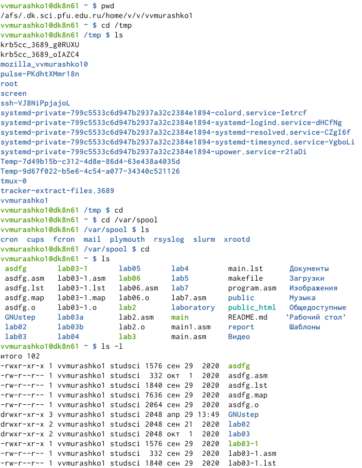
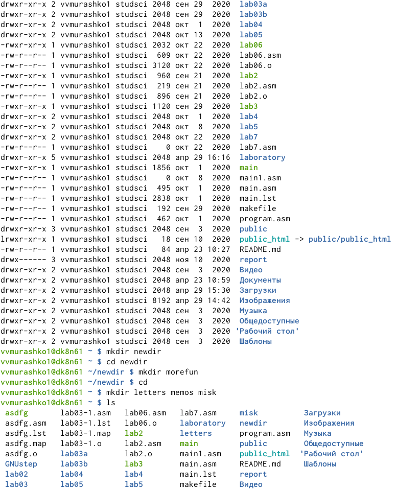
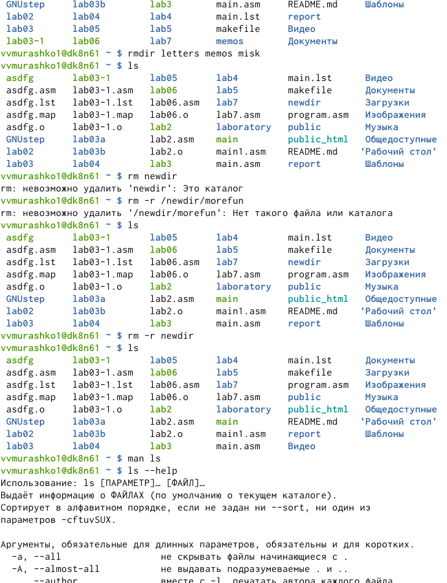
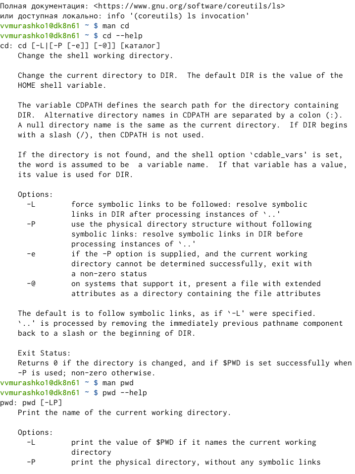
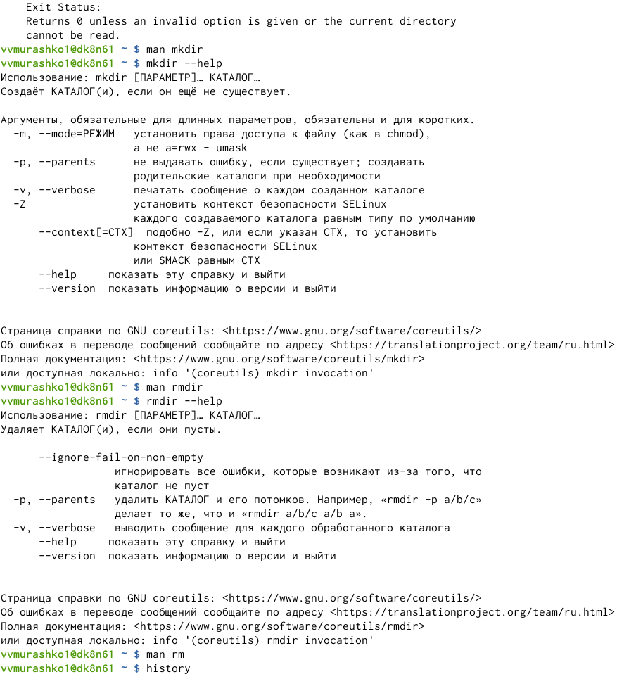
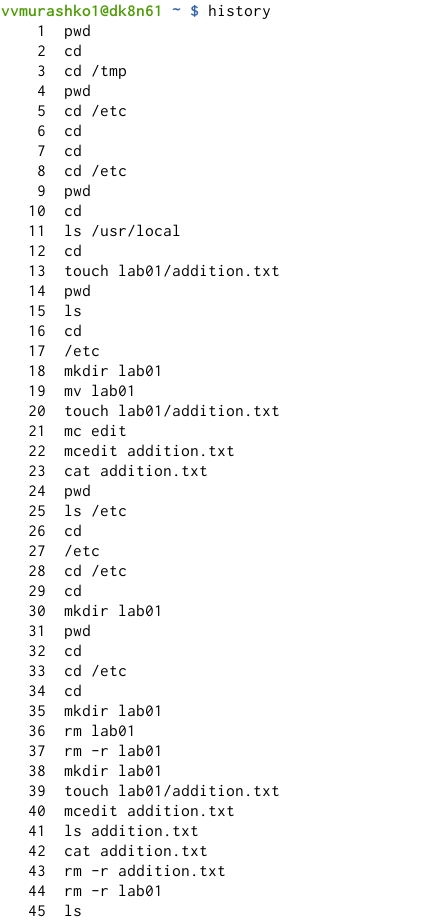
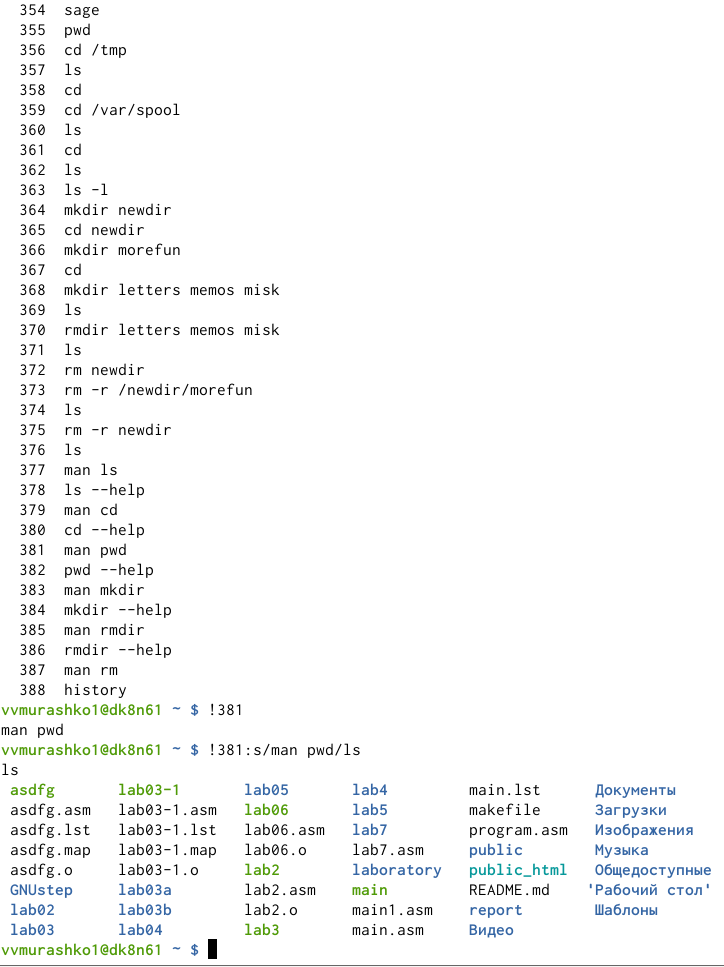

---
## Front matter
lang: ru-RU
title: Основы интерфейса взаимодействия пользователя с системой Unix на уровне командной строки
author: Мурашко В.В.
date: 13.05.2021
## Formatting
toc: false
slide_level: 2
theme: metropolis
header-includes: 
 - \metroset{progressbar=frametitle,sectionpage=progressbar,numbering=fraction}
 - '\makeatletter'
 - '\beamer@ignorenonframefalse'
 - '\makeatother'
aspectratio: 43
section-titles: true
---

# Отчёт по лабораторной работе №5

## Цель работы

Приобретение практических навыков взаимодействия пользователя с системой посредством командной строки.

# Ход работы

## Домашний каталог

{ #fig:001 width=70% }

## Cоздание нового католога с именем newdir

{ #fig:001 width=70% }

## Команда man

{ #fig:001 width=70% }

## Использвание команды man для просмотра описания команд

{ #fig:001 width=70% }

{ #fig:001 width=70% }

## Команда history

{ #fig:001 width=70% }

{ #fig:001 width=70% }

## Вывод

Я приобрела практические навыки взаимодействия пользователя с системой посредством командной строки.
