---
# Front matter
lang: ru-RU
title: "Отчёт по лабораторной работе №6"
subtitle: "Анализ файловой системы Linux. Команды для работы с файлами и каталогами"
author: Мурашко В.В.

# Formatting
toc-title: "Содержание"
toc: true # Table of contents
toc_depth: 2
lof: true # List of figures
lot: true # List of tables
fontsize: 12pt
linestretch: 1.5
papersize: a4paper
documentclass: scrreprt
polyglossia-lang: russian
polyglossia-otherlangs: english
mainfont: PT Serif
romanfont: PT Serif
sansfont: PT Sans
monofont: PT Mono
mainfontoptions: Ligatures=TeX
romanfontoptions: Ligatures=TeX
sansfontoptions: Ligatures=TeX,Scale=MatchLowercase
monofontoptions: Scale=MatchLowercase
indent: true
pdf-engine: lualatex
header-includes:
  - \linepenalty=10 # the penalty added to the badness of each line within a paragraph (no associated penalty node) Increasing the value makes tex try to have fewer lines in the paragraph.
  - \interlinepenalty=0 # value of the penalty (node) added after each line of a paragraph.
  - \hyphenpenalty=50 # the penalty for line breaking at an automatically inserted hyphen
  - \exhyphenpenalty=50 # the penalty for line breaking at an explicit hyphen
  - \binoppenalty=700 # the penalty for breaking a line at a binary operator
  - \relpenalty=500 # the penalty for breaking a line at a relation
  - \clubpenalty=150 # extra penalty for breaking after first line of a paragraph
  - \widowpenalty=150 # extra penalty for breaking before last line of a paragraph
  - \displaywidowpenalty=50 # extra penalty for breaking before last line before a display math
  - \brokenpenalty=100 # extra penalty for page breaking after a hyphenated line
  - \predisplaypenalty=10000 # penalty for breaking before a display
  - \postdisplaypenalty=0 # penalty for breaking after a display
  - \floatingpenalty = 20000 # penalty for splitting an insertion (can only be split footnote in standard LaTeX)
  - \raggedbottom # or \flushbottom
  - \usepackage{float} # keep figures where there are in the text
  - \floatplacement{figure}{H} # keep figures where there are in the text
---

# Цель работы

Ознакомление с файловой системой Linux, её структурой, именами и содержанием каталогов. Приобретение практических навыков по применению команд для работы с файлами и каталогами, по управлению процессами (и работами), по проверке использования диска и обслуживанию файловой системы.

# Задание

1. Выполните все примеры, приведённые в первой части описания лабораторной работы.
2. Выполните следующие действия, зафиксировав в отчёте по лабораторной работеиспользуемые при этом команды и результаты их выполнения: 2.1.Скопируйте файл /usr/include/sys/io.h в домашний каталог и назовите его equipment. Если файла io.h нет, то используйте любой другой файл в каталоге /usr/include/sys/ вместо него. 2.2.В домашнем каталоге создайте директорию~/ski.plases. 2.3.Переместите файл equipment в каталог ~/ski.plases. 2.4.Переименуйте файл ~/ski.plases/equipment в ~/ski.plases/equiplist. 2.5.Создайте в домашнем каталоге файл abc1 и скопируйте его в каталог ~/ski.plases, назовите егоe quiplist2. 2.6.Создайте каталог с именем equipment в каталоге ~/ski.plases. 2.7.Переместите файлы ~/ski.plases/equiplist и equiplist2 в каталог ~/ski.plases/equipment. 2.8.Создайте и переместите каталог ~/newdir в каталог ~/ski.plases и назовите его plans
3. Определите опции команды chmod, необходимые для того, чтобы присвоить перечисленным ниже файлам выделенные права доступа, считая, что в начале таких прав нет: 3.1.drwxr--r--   ...   australia 3.2.drwx--x--x   ...   play 3.3.-r-xr--r--   ...   my_os 3.4.-rw-rw-r--   ...   feathers. При необходимости создайте нужные файлы.
4. Проделайте приведённые ниже упражнения, записывая в отчёт по лабораторной работе используемые при этом команды: 4.1.Просмотрите содержимое файла /etc/password. 4.2.Скопируйте файл ~/feathers в файл ~/file.old. 4.3.Переместите файл ~/file.old в каталог ~/play. 4.4.Скопируйте каталог ~/play в каталог ~/fun. 4.5.Переместите каталог ~/fun в каталог ~/play и назовите его games. 4.6.Лишите владельца файла ~/feathers права на чтение.4.7.Что произойдёт, если вы попытаетесь просмотреть файл ~/feathers командой cat? 4.8.Что произойдёт, если вы попытаетесь скопировать файл ~/feathers? 4.9.Дайте владельцу файла ~/feathers право на чтение. 4.10.Лишите владельца каталога ~/play права на выполнение. 4.11.Перейдите в каталог ~/play. Что произошло? 4.12.Дайте владельцу каталога ~/play право на выполнение.
5. Прочитайте man по командам mount, fsck, mkfs, kill и кратко их охарактеризуйте, приведя примеры.

# Выполнение лабораторной работы

1. Я выполнила все примеры, приведённые в первой части описания лабораторной работы.

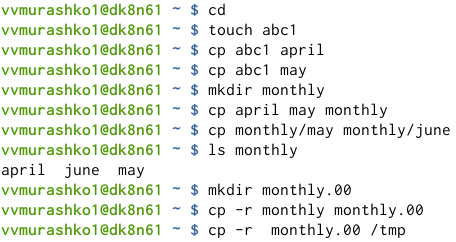{ #fig:001 width=70% }

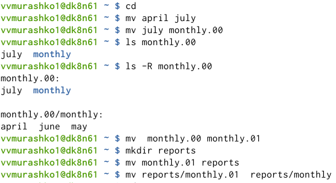{ #fig:001 width=70% }

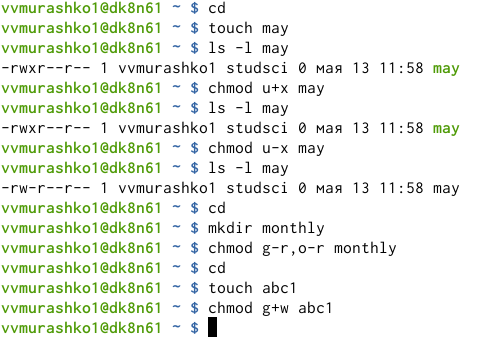{ #fig:001 width=70% }

2. Я выполнила следующие действия, зафиксировав в отчёте по лабораторной работе используемые при этом команды и результаты их выполнения.

Я скопировала файл /usr/include/sys/io.h в домашний каталог и назвала его equipment.

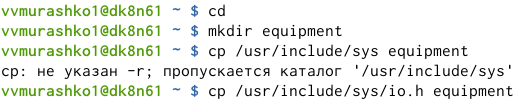{ #fig:001 width=70% }

В домашнем каталоге я создала директорию ~/ski.plases.

{ #fig:001 width=70% }

Я переместила файл equipment в каталог ~/ski.plases.

{ #fig:001 width=70% }

Я переименовала файл ~/ski.plases/equipment в ~/ski.plases/equiplist

{ #fig:001 width=70% }

Я создала в домашнем каталоге файл abc1 и скопировала его в каталог ~/ski.plases, назвала его equiplist2.

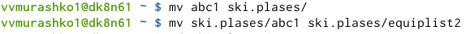{ #fig:001 width=70% }

Я создала каталог с именем equipment в каталоге ~/ski.plases.

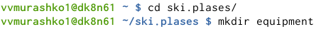{ #fig:001 width=70% }

Я переместите файлы ~/ski.plases/equiplist и equiplist2 в каталог ~/ski.plases/equipment.

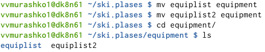{ #fig:001 width=70% }

Я создала и переместила каталог ~/newdir в каталог ~/ski.plases и назвала его plans.

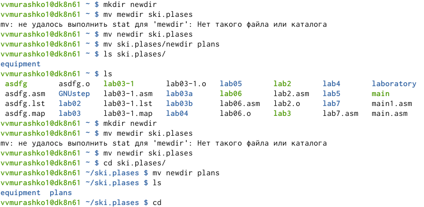{ #fig:001 width=70% }

3. Я определила опции команды chmod, необходимые для того, чтобы присвоить перечисленным ниже файлам выделенные права доступа, считая, что в начале таких прав нет.

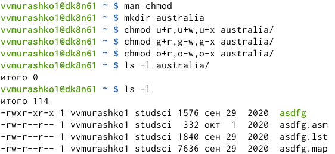{ #fig:001 width=70% }

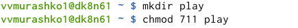{ #fig:001 width=70% }

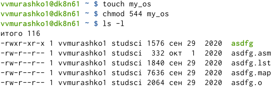{ #fig:001 width=70% }

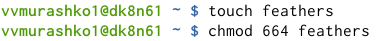{ #fig:001 width=70% }

4. Я проделала приведённые ниже упражнения, записывая в отчёт по лабораторной работе используемые при этом команды.

Я просмотрела содержимое файла /etc/password.

{ #fig:001 width=70% }

Я скопировала файл ~/feathers в файл ~/file.old

{ #fig:001 width=70% }

Я переместила файл ~/file.old в каталог ~/play.

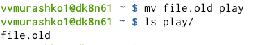{ #fig:001 width=70% }

Я скопировала каталог ~/play в каталог ~/fun.

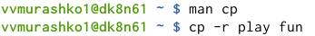{ #fig:001 width=70% }

Я переместила каталог ~/fun в каталог ~/play и назвала его games.

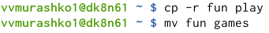{ #fig:001 width=70% }

Я лишила владельца файла ~/feathers права на чтение.

{ #fig:001 width=70% }

Я попыталась просмотреть файл ~/feathers командой cat.

Я попыталась скопировать файл ~/feathers.

Я дала владельцу файла ~/feathers право на чтение.

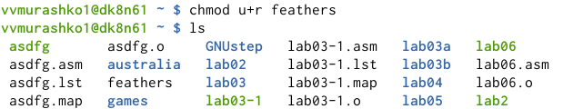{ #fig:001 width=70% }

Я лишила владельца каталога ~/play права на выполнение.

{ #fig:001 width=70% }

Я перешла в каталог ~/play.

{ #fig:001 width=70% }

Я дала владельцу каталога ~/play право на выполнение.

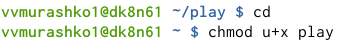{ #fig:001 width=70% }

5. Я прочитала man по командам mount, fsck, mkfs, kill и кратко их охарактеризовала, приведя примеры.

{ #fig:001 width=70% }

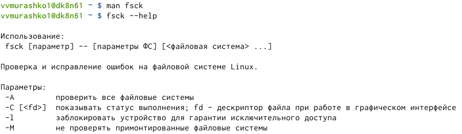{ #fig:001 width=70% }

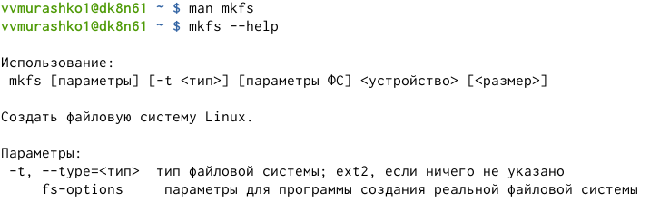{ #fig:001 width=70% }

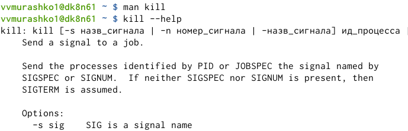{ #fig:001 width=70% }

# Выводы

Я ознакомилась с файловой системой Linux, её структурой, именами и содержанием каталогов, приобрела практические навыки по применению команд для работы с файлами и каталогами, по управлению процессами (и работами), по проверке использования диска и обслуживанию файловой системы.
