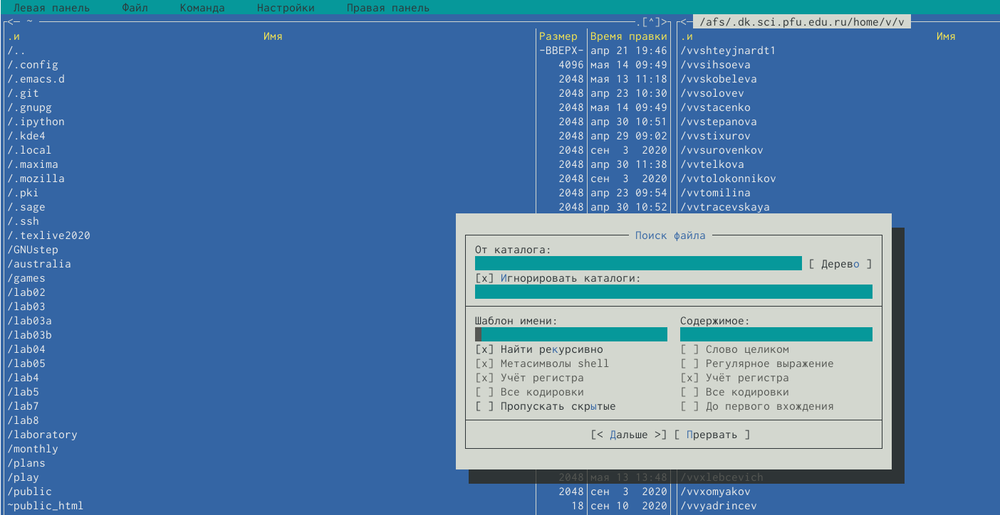

---
## Front matter
lang: ru-RU
title: Командная оболочка Midnight Commander
author: Мурашко В.В.
date: 14.05.2021

## Formatting
toc: false
slide_level: 2
theme: metropolis
header-includes: 
 - \metroset{progressbar=frametitle,sectionpage=progressbar,numbering=fraction}
 - '\makeatletter'
 - '\beamer@ignorenonframefalse'
 - '\makeatother'
aspectratio: 43
section-titles: true
---

# Отчёт по лабораторной работе №8

## Цель работы

Освоение основных возможностей командной оболочки Midnight Commander. Приобретение навыков практической работы по просмотру каталогов и файлов; манипуляций с ними.

# Задание по mc

## Информация о mc

{ #fig:001 width=70% }

## Редактор mc

{ #fig:001 width=70% }

## Копирование

{ #fig:001 width=70% }

## Перемещение

{ #fig:001 width=70% }

## Основные команды меню

{ #fig:001 width=70% }

## Основные команды меню

{ #fig:001 width=70% }

## Основные команды меню

{ #fig:001 width=70% }

## Основные команды меню

{ #fig:001 width=70% }

## Содержимое текстового файла

{ #fig:001 width=70% }

## Редактирование содержимого

{ #fig:001 width=70% }

## Создание каталога

{ #fig:001 width=70% }

## Копирование файлов

{ #fig:001 width=70% }

## Поиск файла

{ #fig:001 width=70% }

## Поиск файла

{ #fig:001 width=70% }

## Повторение одной из команд

{ #fig:001 width=70% }

## Переход в домашний каталог

{ #fig:001 width=70% }

## Анализ файла меню

{ #fig:001 width=70% }

## Анализ файла расширения

{ #fig:001 width=70% }

## Подменю Настройки

{ #fig:001 width=70% }

# Задание по встроенному редактору mc

## Создание текстового файла

{ #fig:001 width=70% }

## Текстовый файл

{ #fig:001 width=70% }

## Вставка текста

{ #fig:001 width=70% }

## Удаление строки

{ #fig:001 width=70% }

## Копирование фрагмента текста

{ #fig:001 width=70% }

## Перенос фрагмента текста

{ #fig:001 width=70% }

## Сохранение файла

{ #fig:001 width=70% }

## Отмена последнего действия

{ #fig:001 width=70% }

## Новый текст в конце файла

{ #fig:001 width=70% }

## Новый текст в начале файла

{ #fig:001 width=70% }

## Файл с исходным текстом

{ #fig:001 width=70% }

## Выключение подсветки

{ #fig:001 width=70% }

## Выводы

Я освоила основные возможности командной оболочки Midnight Commander и приобрела навыки практической работы по просмотру каталогов и файлов; манипуляций с ними.

