---
## Front matter
lang: ru-RU
title: Текстовой редактор vi
author: Мурашко В.В.
date: 20.05.2021
## Formatting
toc: false
slide_level: 2
theme: metropolis
header-includes: 
 - \metroset{progressbar=frametitle,sectionpage=progressbar,numbering=fraction}
 - '\makeatletter'
 - '\beamer@ignorenonframefalse'
 - '\makeatother'
aspectratio: 43
section-titles: true
---

# Отчёт по лабораторной работе №9

## Цель работы

Познакомиться с операционной системой Linux. Получить практические навыки работы с редактором vi, установленным по умолчанию практически во всех дистрибутивах.

## Выполнение лабораторной работы

1. Я ознакомилась с теоретическим материалом.
2. Я ознакомилась с редактором vi.
3. Я выполнила упражнения, используя команды vi.

# Задание 1. Создание нового файла с использованием vi

## Созданиe каталога

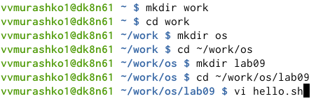{ #fig:001 width=70% }

## Текст

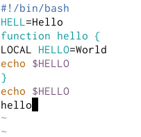{ #fig:001 width=70% }

## Приглашение в виде двоеточия

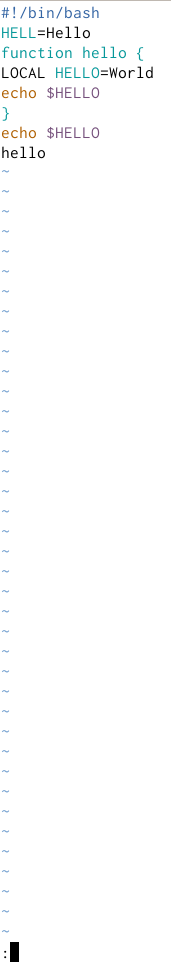{ #fig:001 width=70% }

## Сохранение текста и завершение работы

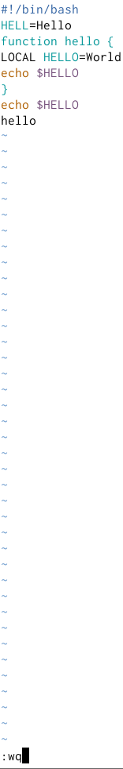{ #fig:001 width=70% }

## Исполняемый файл

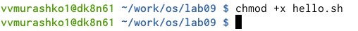{ #fig:001 width=70% }

# Задание 2. Редактирование существующего файла

## Редактор vi

{ #fig:001 width=70% }

## Установка курсора

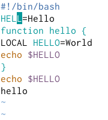{ #fig:001 width=70% }

## Режим вставки

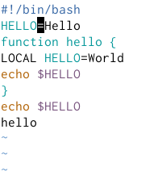{ #fig:001 width=70% }

## Установка курсора

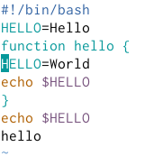{ #fig:001 width=70% }

## Режим вставки

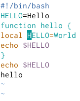{ #fig:001 width=70% }

## Установка курсора

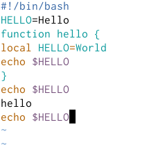{ #fig:001 width=70% }

## Удаление строки

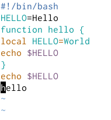{ #fig:001 width=70% }

## Команда u

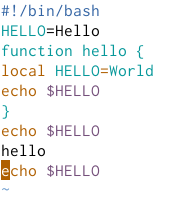{ #fig:001 width=70% }

## Символ :

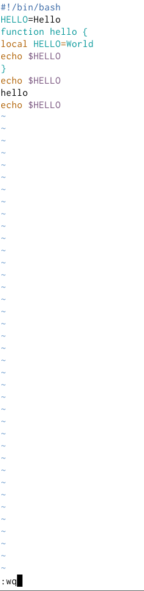{ #fig:001 width=70% }

## Вывод

Я познакомилась с операционной системой Linux и получила практические навыки работы с редактором vi, установленным по умолчанию практически во всех дистрибутивах.
