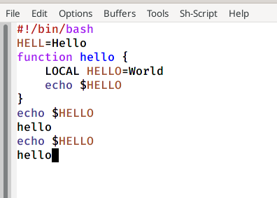

---
## Front matter
lang: ru-RU
title: Текстовой редактор emacs
author: Мурашко В.В.
date: 20.05.2021

## Formatting
toc: false
slide_level: 2
theme: metropolis
header-includes: 
 - \metroset{progressbar=frametitle,sectionpage=progressbar,numbering=fraction}
 - '\makeatletter'
 - '\beamer@ignorenonframefalse'
 - '\makeatother'
aspectratio: 43
section-titles: true
---

# Отчёт по лабораторной работе №10

## Цель работы

Познакомиться с операционной системой Linux. Получить практические навыки работы с редактором Emacs.

# Основные команды emacs

## Emacs

{ #fig:001 width=70% }

## Создание файла

{ #fig:001 width=70% }

## Текст

{ #fig:001 width=70% }

## Сохранение файла

{ #fig:001 width=70% }

## Вырезка целой строки

{ #fig:001 width=70% }

## Вставка строки

{ #fig:001 width=70% }

## Выделение области текста

{ #fig:001 width=70% }

## Вставка области

{ #fig:001 width=70% }

## Выделение и вырезка области

{ #fig:001 width=70% }

## Отмена последнего действия

{ #fig:001 width=70% }

## Перемещение курсора в начало строки

{ #fig:001 width=70% }

## Перемещение курсора в конец строки

{ #fig:001 width=70% }

## Перемещение курсора в начало буфера

{ #fig:001 width=70% }

## Перемещение курсора в конец буфера

{ #fig:001 width=70% }

## Список активных буферов
{ #fig:001 width=70% }

## Другой буфер

{ #fig:001 width=70% }

## Закрытие окна

{ #fig:001 width=70% }

## Переключение между буферами

{ #fig:001 width=70% }

## 4 части фрейма

{ #fig:001 width=70% }

## Новый буфер с текстом

{ #fig:001 width=70% }

## Режим поиска

{ #fig:001 width=70% }

## Переключение между результатми

{ #fig:001 width=70% }

## Выход из режима поиска

{ #fig:001 width=70% }

## Режим поиска и замены

{ #fig:001 width=70% }

## Другой режим поиска

{ #fig:001 width=70% }

## Другой режим поиска

{ #fig:001 width=70% }

## Вывод

Я познакомилась с операционной системой Linux и получила практические навыки работы с редактором Emacs.
