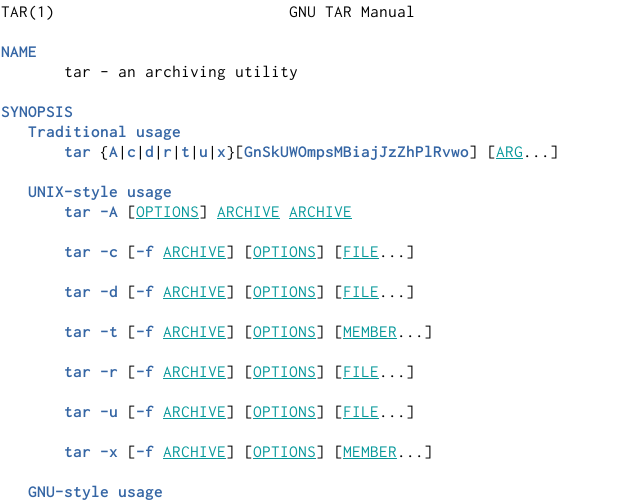
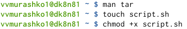
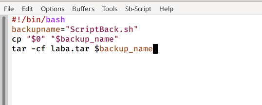
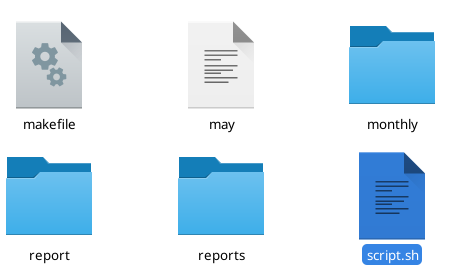
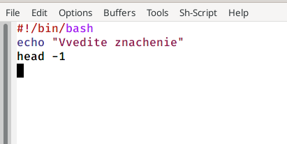
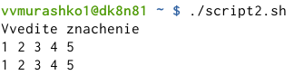
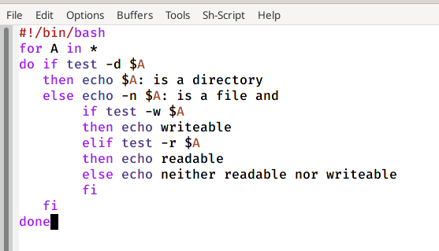
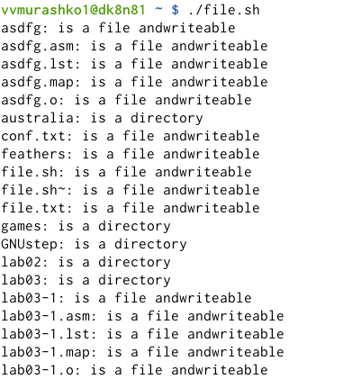
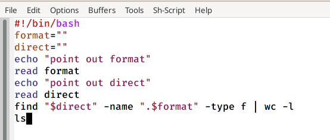
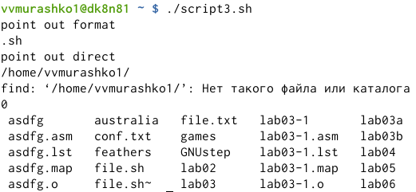

---
## Front matter
lang: ru-RU
title: Программирование в командном процессоре ОС UNIX. Командные файлы
author: Мурашко В.В.
date: 26.05.2021

## Formatting
toc: false
slide_level: 2
theme: metropolis
header-includes: 
 - \metroset{progressbar=frametitle,sectionpage=progressbar,numbering=fraction}
 - '\makeatletter'
 - '\beamer@ignorenonframefalse'
 - '\makeatother'
aspectratio: 43
section-titles: true
---

# Отчёт по лабораторной работе №11

## Цель работы

Изучить основы программирования в оболочке ОС UNIX/Linux. Научиться писать небольшие командные файлы.

# Выполнение лабораторной работы

## Справка команды архивации

{ #fig:001 width=70% }

## Создание файла и дача ему права

{ #fig:001 width=70% }

## Скрипт 1

{ #fig:001 width=70% }

## Скрипт в домашней папке

{ #fig:001 width=70% }

## Скрипт 2

{ #fig:001 width=70% }

## Вывод всех переданных аргументов

{ #fig:001 width=70% }

## Командный файл

{ #fig:001 width=70% }

## Информация

{ #fig:001 width=70% }

## Скрипт 3

{ #fig:001 width=70% }

## Вычисление количества файлов

{ #fig:001 width=70% }

## Вывод

Я изучила основы программирования в оболочке ОС UNIX/Linux и научилась писать небольшие командные файлы.
