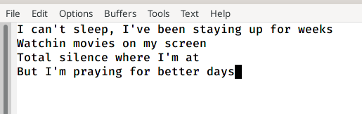
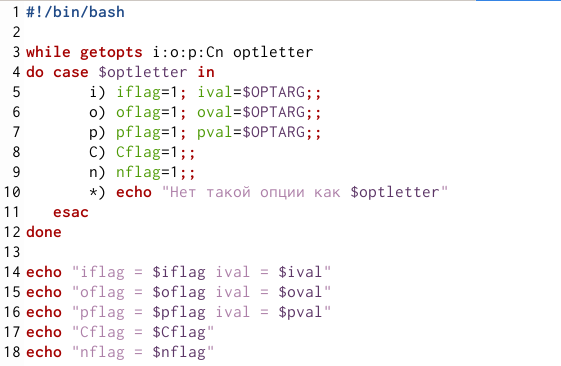
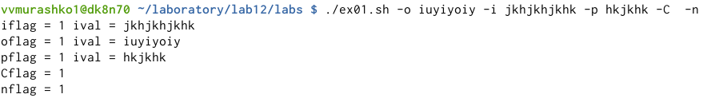
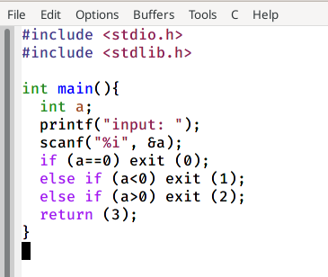
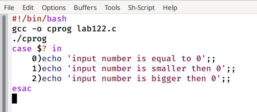
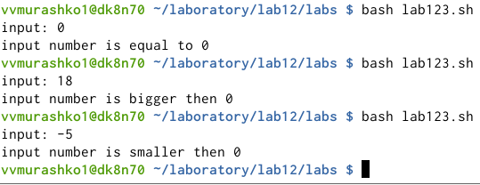
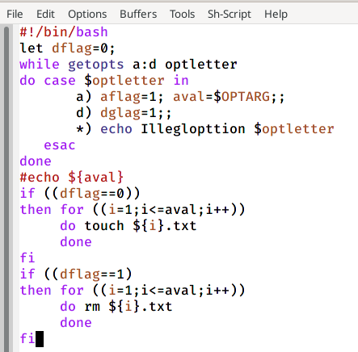
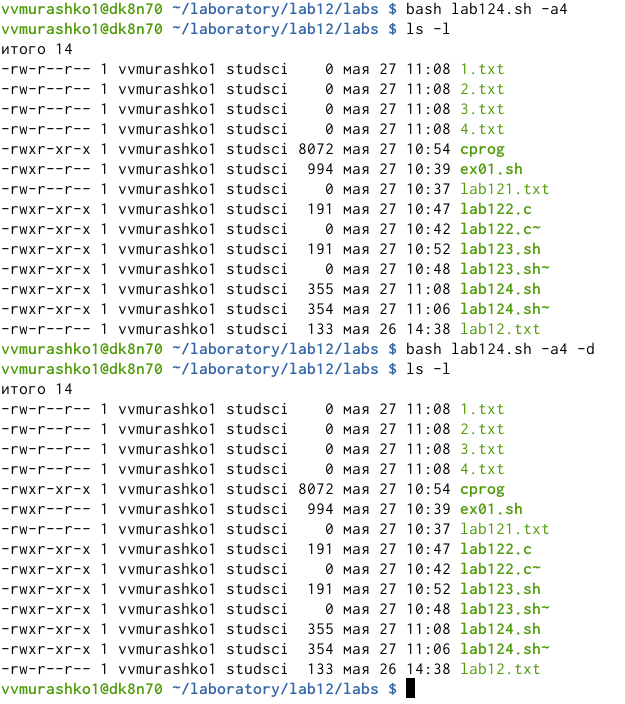
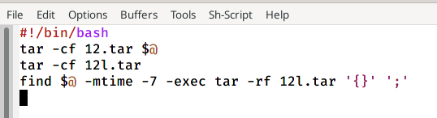
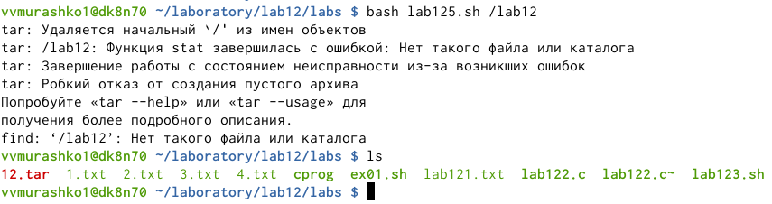

---
## Front matter
lang: ru-RU
title: Программирование в командном процессоре ОС UNIX. Ветвления и циклы
author: Мурашко В.В.
date: 27.05.2021

## Formatting
toc: false
slide_level: 2
theme: metropolis
header-includes: 
 - \metroset{progressbar=frametitle,sectionpage=progressbar,numbering=fraction}
 - '\makeatletter'
 - '\beamer@ignorenonframefalse'
 - '\makeatother'
aspectratio: 43
section-titles: true
---

# Отчёт по лабораторной рабоите №12

## Цель работы

Изучить основы программирования в оболочке ОС UNIX. Научится писать более сложные командные файлы с использованием логических управляющих конструкций и циклов.

# Выполнение лабораторной работы

## Текст

{ #fig:001 width=70% }

## Командный файл

{ #fig:001 width=70% }

## Анализ командной строки с ключами

{ #fig:001 width=70% }

## Программа на языке C

{ #fig:001 width=70% }

## Командный файл

{ #fig:001 width=70% }

## Ввод чисел

{ #fig:001 width=70% }

## Командный файл

{ #fig:001 width=70% }

## Число файлов от 1 до N и их удаление

{ #fig:001 width=70% }

## Командный файл

{ #fig:001 width=70% }

## Архив всех файлов в директории

{ #fig:001 width=70% }

## Вывод

Я изучила основы программирования в оболочке ОС UNIX и научилась писать более сложные командные файлы с использованием логических управляющих конструкций и циклов.
