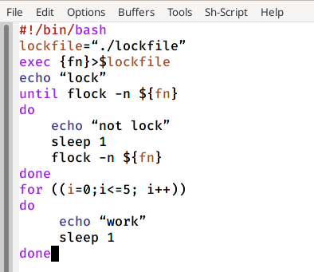
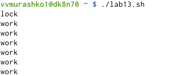
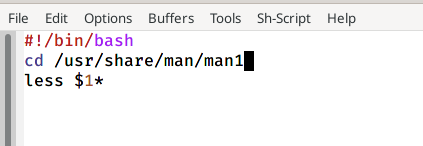
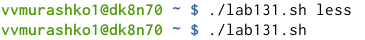
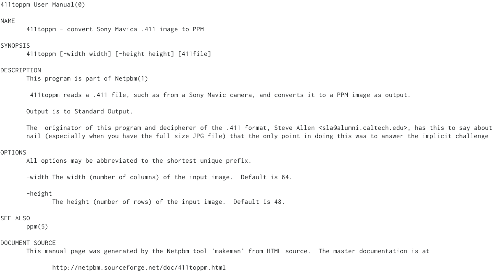
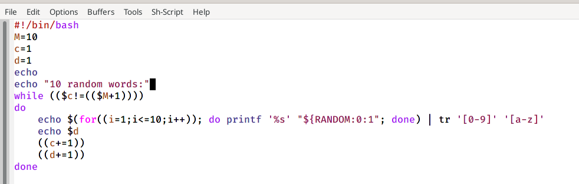
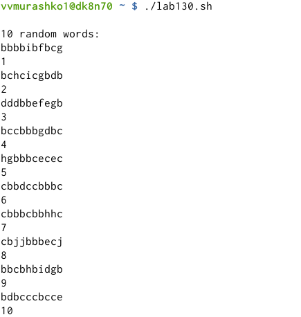

---
## Front matter
lang: ru-RU
title: Программирование в командном процессоре OC UNIX. Расширенное программирование
author: Мурашко В.В.
date: 03.06.2021

## Formatting
toc: false
slide_level: 2
theme: metropolis
header-includes: 
 - \metroset{progressbar=frametitle,sectionpage=progressbar,numbering=fraction}
 - '\makeatletter'
 - '\beamer@ignorenonframefalse'
 - '\makeatother'
aspectratio: 43
section-titles: true
---

## Цель работы

Изучить основы программирования в оболочке OC UNIX. Научиться писать более сложные командные файлы с использованием логических управляющих конструкций и циклов.

# Выполнение лабораторной работы

## Создание файла и дача ему прав

{ #fig:001 width=70% }

## Командный файл

{ #fig:001 width=70% } 

## Упрощённый механизм семафоров

{ #fig:001 width=70% } 

## Создание файла и дача ему прав

{ #fig:001 width=70% } 

## Командный файл

{ #fig:001 width=70% } 

## Открытие архива

{ #fig:001 width=70% } 

## Содержимое справки

{ #fig:001 width=70% } 

## Создание файла и дача ему прав

{ #fig:001 width=70% } 

## Командный файл

{ #fig:001 width=70% } 

## Случайная последовательность букв

{ #fig:001 width=70% } 

## Вывод

Я изучила основы программирования в оболочке OC UNIX и научилась писать более сложные командные файлы с использованием логических управляющих конструкций и циклов.
