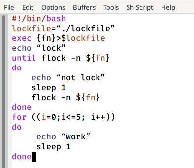
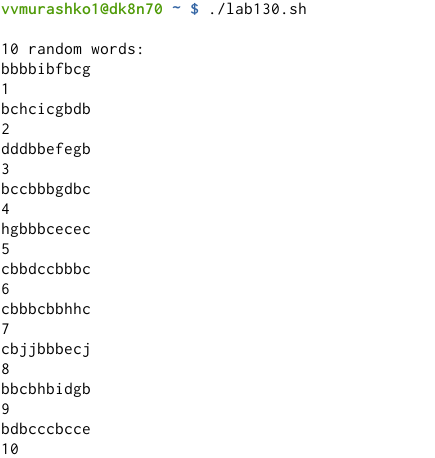

---
# Front matter
lang: ru-RU
title: "Программирование в командном процессоре OC UNIX. Расширенное программирование"
subtitle: "Отчёт по лабораторной работе №13"
author: "Мурашко В.В."

# Formatting
toc-title: "Содержание"
toc: true # Table of contents
toc_depth: 2
lof: true # List of figures
lot: true # List of tables
fontsize: 12pt
linestretch: 1.5
papersize: a4paper
documentclass: scrreprt
polyglossia-lang: russian
polyglossia-otherlangs: english
mainfont: PT Serif
romanfont: PT Serif
sansfont: PT Sans
monofont: PT Mono
mainfontoptions: Ligatures=TeX
romanfontoptions: Ligatures=TeX
sansfontoptions: Ligatures=TeX,Scale=MatchLowercase
monofontoptions: Scale=MatchLowercase
indent: true
pdf-engine: lualatex
header-includes:
  - \linepenalty=10 # the penalty added to the badness of each line within a paragraph (no associated penalty node) Increasing the value makes tex try to have fewer lines in the paragraph.
  - \interlinepenalty=0 # value of the penalty (node) added after each line of a paragraph.
  - \hyphenpenalty=50 # the penalty for line breaking at an automatically inserted hyphen
  - \exhyphenpenalty=50 # the penalty for line breaking at an explicit hyphen
  - \binoppenalty=700 # the penalty for breaking a line at a binary operator
  - \relpenalty=500 # the penalty for breaking a line at a relation
  - \clubpenalty=150 # extra penalty for breaking after first line of a paragraph
  - \widowpenalty=150 # extra penalty for breaking before last line of a paragraph
  - \displaywidowpenalty=50 # extra penalty for breaking before last line before a display math
  - \brokenpenalty=100 # extra penalty for page breaking after a hyphenated line
  - \predisplaypenalty=10000 # penalty for breaking before a display
  - \postdisplaypenalty=0 # penalty for breaking after a display
  - \floatingpenalty = 20000 # penalty for splitting an insertion (can only be split footnote in standard LaTeX)
  - \raggedbottom # or \flushbottom
  - \usepackage{float} # keep figures where there are in the text
  - \floatplacement{figure}{H} # keep figures where there are in the text
---

# Теоретическое введение

UNIX - это многозадачная, многопользовательская операционная система (ОС) общего назначения. Многозадачность означает, что в среде одновременно могут выполняться несколько программ. Термин многопользовательская "говорит" о том, что в системе одновременно могут работать несколько пользователей.

Операционная система UNIX была создана в первой половине 70-х годов в подразделении фирмы АТ&T, называемом Веll Теlephone Labs. Первая версия системы была реализована на мини-ЭВМ РDP/7 и предназначалась, в основном, для обработки текстовой информации. Пройдя успешную проверку, система получила дальнейшее развитие. Большая часть кодов была переписана с ассемблера РDP на язык высокого уровня Си, разрабатываемый в то же время в упомянутой фирме. UNIX удачно отражал особенности существовавших в то время операционных систем и был применен в ряде университетов Северной Америки для обучения студентов принципам построения ОС. В начале 80-х годов UNIX был установлен на ряде вычислительных машин, отличных по своей архитектуре от РDР. В середине 80-х система привлекла внимание фирм-производителей компьютерного оборудования и программного обеспечения. Появились первые коммерческие версии UNIX. Они получили широкое распространение во всем мире. Сегодня трудно назвать ЭВМ, для которой не была бы разработана версия этой ОС (в дальнейшем версии системы мы также буден называть ее диалектами).

Широкое распространение системы UNIX объясняется простотой ее устройства и легкостью переноса на компьютеры разной архитектуры. Последнее есть следствие того, что ОС написана на языке высокого уровня, и машинно-зависимые ее части невелики по объему и четко выделены. Но слаба машинная зависимость имеет и свои недостатки. Основным из них является некоторое снижение производительности UNIX по сравнению с системами, разработанными для конкретной ЭВМ и в большей степени учитывающими ее аппаратные особенности.

# Цель работы

Изучить основы программирования в оболочке OC UNIX. Научиться писать более сложные командные файлы с использованием логических управляющих конструкций и циклов.

# Задание

1. Написать командный файл, реализующий упрощённый механизм семафоров. Командный файл должен в течение некоторого времени t1 дожидаться освобождения ресурса, выдавая об этом сообщение, а дождавшись его освобождения, использовать его в течение некоторого времени t2<>t1, также выдавая информацию о том, что ресурс используется соответствующим командным файлом (процессом). Запустить командный файл в одном виртуальном терминале в фоновом режиме, перенаправив его вывод в другой (> /dev/tty#, где # — номер терминала куда перенаправляется вывод), в котором также запущен этот файл, но не в фоновом, а привилегированном режиме. Доработать программу так, чтобы имелась возможность взаимодействия трёх и более процессов.
2. Реализовать команду man с помощью командного файла. Изучите содержимое каталога /usr/share/man/man1. В нем находятся архивы текстовых файлов, содержащих справку по большинству установленных в системе программ и команд. Каждый архив можно открыть командой less, сразу же просмотрев содержимое справки. Командный файл должен получать в виде аргумента командной строки название команды и в виде результата выдавать справку об этой команде или сообщение об отсутствии справки, если соответствующего файла нет в каталоге man1.
3. Используя встроенную переменную $RANDOM, напишите командный файл, генерирующий случайную последовательность букв латинского алфавита. Учтите, что $RANDOM выдаёт псевдослучайные числа в диапазоне от 0 до 32767.

# Выполнение лабораторной работы

1. Я написала командный файл, реализующий упрощённый механизм семафоров. Я запустила командный файл в одном виртуальном терминале в фоновом режиме, перенаправив его вывод в другой (> /dev/tty#, где # — номер терминала куда перенаправляется вывод), в котором также запущен этот файл, но не в фоновом, а привилегированном режиме. Я доработала программу так, чтобы имелась возможность взаимодействия трёх и более процессов.

{ #fig:001 width=70% }

{ #fig:001 width=70% } 

{ #fig:001 width=70% } 

2. Я реализовала команду man с помощью командного файла. Я изучила содержимое каталога /usr/share/man/man1. Командный файл должен получать в виде аргумента командной строки название команды и в виде результата выдавать справку об этой команде или сообщение об отсутствии справки, если соответствующего файла нет в каталоге man1.

{ #fig:001 width=70% } 

{ #fig:001 width=70% } 

{ #fig:001 width=70% } 

{ #fig:001 width=70% } 

3. Я, используя встроенную переменную $RANDOM, написала командный файл, генерирующий случайную последовательность букв латинского алфавита.

{ #fig:001 width=70% } 

{ #fig:001 width=70% } 

{ #fig:001 width=70% } 

# Выводы

Я изучила основы программирования в оболочке OC UNIX и научилась писать более сложные командные файлы с использованием логических управляющих конструкций и циклов.

# Библиография

https://www.opennet.ru/docs/RUS/xtoolkit/x-1.html

# Контрольные вопросы

1. В строке while [$1 != "exit"] квадратные скобки надо заменить на круглые.
2. Есть несколько видов конкатенации строк. Например,

VAR1="Hello,"

VAR2=" World"

VAR3="$VAR1$VAR2"

echo "$VAR3"
3. Команда seq выводит последовательность целых или действительных чисел, подходящую для передачи в другие программы. В bash можно использовать seq с циклом for, используя подстановку команд. Например,
$ for i in $(seq 1 0.5 4)
do
echo "The number is $i"
done
4. Результатом вычисления выражения $((10/3)) будет число 3.
5. Список того, что можно получить, используя Z Shell вместо Bash:

Встроенная команда zmv поможет массово переименовать файлы/директории, например, чтобы добавить ‘.txt’ к имени каждого файла, запустите zmv –C '(*)(#q.)' '$1.txt'.

Утилита zcalc — это замечательный калькулятор командной строки, удобный способ считать быстро, не покидая терминал. 

Команда zparseopts — это однострочник, который поможет разобрать сложные варианты, которые предоставляются скрипту.

Команда autopushd позволяет делать popd после того, как с помощью cd, чтобы вернуться в предыдущую директорию.

Поддержка чисел с плавающей точкой (коей Bash не содержит).

Поддержка для структур данных «хэш».

Есть также ряд особенностей, которые присутствуют только в Bash:

Опция командной строки –norc, которая позволяет пользователю иметь дело с инициализацией командной строки, не читая файл .bashrc

Использование опции –rcfile <filename> с bash позволяет исполнять команды из определённого файла.

Отличные возможности вызова (набор опций для командной строки)

Может быть вызвана командой sh

Bash можно запустить в определённом режиме POSIX.  Примените set –o posix, чтобы включить режим, или ––posix при запуске.

Можно управлять видом командной строки в Bash. Настройка переменной PROMPT_COMMAND с одним или более специальными символами настроит её за вас.

Bash также можно включить в режиме ограниченной оболочки (с rbash или --restricted), это означает, что некоторые команды/действия больше не будут доступны:

Настройка и удаление значений служебных переменных SHELL, PATH, ENV, BASH_ENV

Перенаправление вывода с использованием операторов ‘>’, ‘>|’, ‘<>’, ‘>&’, ‘&>’, ‘>>’

Разбор значений SHELLOPTS из окружения оболочки при запуске

Использование встроенного оператора exec, чтобы заменить оболочку другой командой
6. Синтаксис конструкции for ((a=1; a <= LIMIT; a++)) верен.
7. Язык bash и другие языки программирования:

-Скорость работы программ на ассемблере может быть более 50% медленнее, чем программ на си/си++, скомпилированных с максимальной оптимизацией;

-Скорость работы виртуальной ява-машины с байт-кодом часто превосходит скорость аппаратуры с кодами, получаемыми трансляторами с языков высокого уровня. Ява-машина уступает по скорости только ассемблеру и лучшим оптимизирующим трансляторам;

-Скорость компиляции и исполнения программ на яваскрипт в популярных браузерах лишь в 2-3 раза уступает лучшим трансляторам и превосходит даже некоторые качественные компиляторы, безусловно намного (более чем в 10 раз) обгоняя большинство трансляторов других языков сценариев и подобных им по скорости исполнения программ;

-Скорость кодов, генерируемых компилятором языка си фирмы Intel, оказалась заметно меньшей, чем компилятора GNU и иногда LLVM;

-Скорость ассемблерных кодов x86-64 может меньше, чем аналогичных кодов x86, примерно на 10%;

-Оптимизация кодов лучше работает на процессоре Intel;

-Скорость исполнения на процессоре Intel была почти всегда выше, за исключением языков лисп, эрланг, аук (gawk, mawk) и бэш. Разница в скорости по бэш скорее всего вызвана разными настройками окружения на тестируемых системах, а не собственно транслятором или железом. Преимущество Intel особенно заметно на 32-разрядных кодах;

-Стек большинства тестируемых языков, в частности, ява и яваскрипт, поддерживают только очень ограниченное число рекурсивных вызовов. Некоторые трансляторы (gcc, icc, ...) позволяют увеличить размер стека изменением переменных среды исполнения или параметром;

-В рассматриваемых версиях gawk, php, perl, bash реализован динамический стек, позволяющий использовать всю память компьютера. Но perl и, особенно, bash используют стек настолько экстенсивно, что 8-16 ГБ не хватает для расчета ack(5,2,3)
