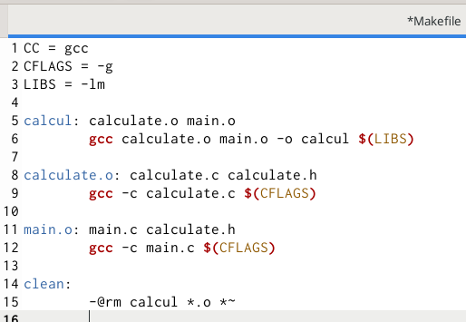

---
## Front matter
lang: ru-RU
title: Средства, применяемые при разработке программного обеспечения в ОС типа UNIX/Linux
author: Мурашко В.В.
date: 03.06.2021

## Formatting
toc: false
slide_level: 2
theme: metropolis
header-includes: 
 - \metroset{progressbar=frametitle,sectionpage=progressbar,numbering=fraction}
 - '\makeatletter'
 - '\beamer@ignorenonframefalse'
 - '\makeatother'
aspectratio: 43
section-titles: true
---

# Отчёт по лабораторной работе №14

## Цель работы

Приобрести простейшие навыки разработки, анализа, тестирования и отладкиприложений в ОС типа UNIX/Linux на примере создания на языке программирования С калькулятора с простейшими функциями.

# Выполнение лабораторной работы

## Создание подкаталога

{ #fig:001 width=70% }

## Создание файлов

{ #fig:001 width=70% }

## Реализация функций калькулятора в файле calculate.c

{ #fig:001 width=70% }

## Реализация функций калькулятора в файле calculate.c

{ #fig:001 width=70% }

## Интерфейсный файл calculate.h

{ #fig:001 width=70% }

## Основной файл main.c

{ #fig:001 width=70% }

## Команда gcc

{ #fig:001 width=70% }

## Компиляция

{ #fig:001 width=70% }

## Makefile

{ #fig:001 width=70% }

## Отладчик GDB и run

{ #fig:001 width=70% }

## Команда list

{ #fig:001 width=70% }

## Команда list, точка останова и информация

{ #fig:001 width=70% }

## Run, команда backtrace, Numeral и удаление точки останова

{ #fig:001 width=70% }

## Анализ calculate.c

{ #fig:001 width=70% }

## Анализ main.c

{ #fig:001 width=70% }

## Вывод

Я приобрела простейшие навыки разработки, анализа, тестирования и отладкиприложений в ОС типа UNIX/Linux на примере создания на языке программирования С калькулятора с простейшими функциями.
