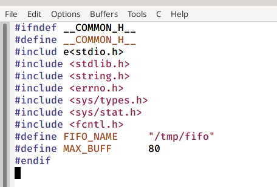
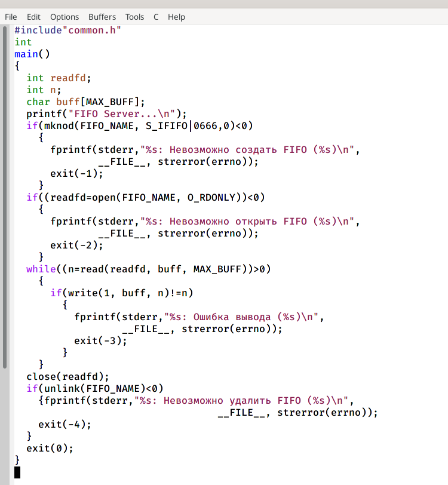
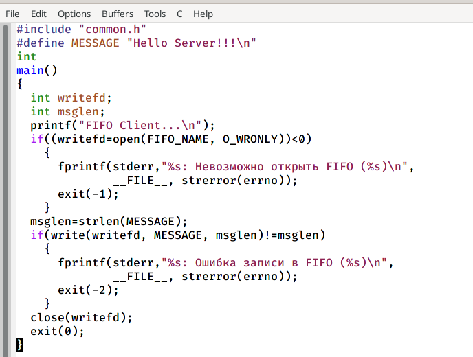
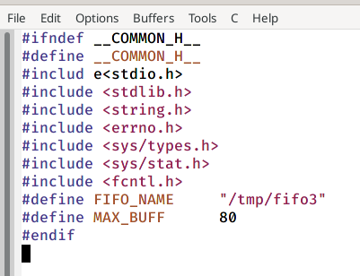
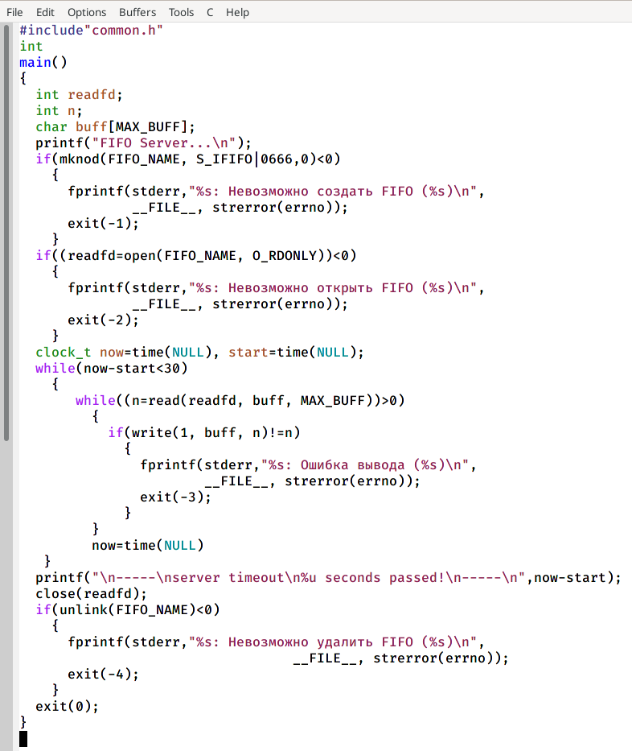
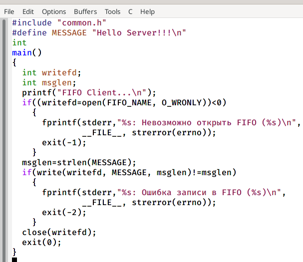
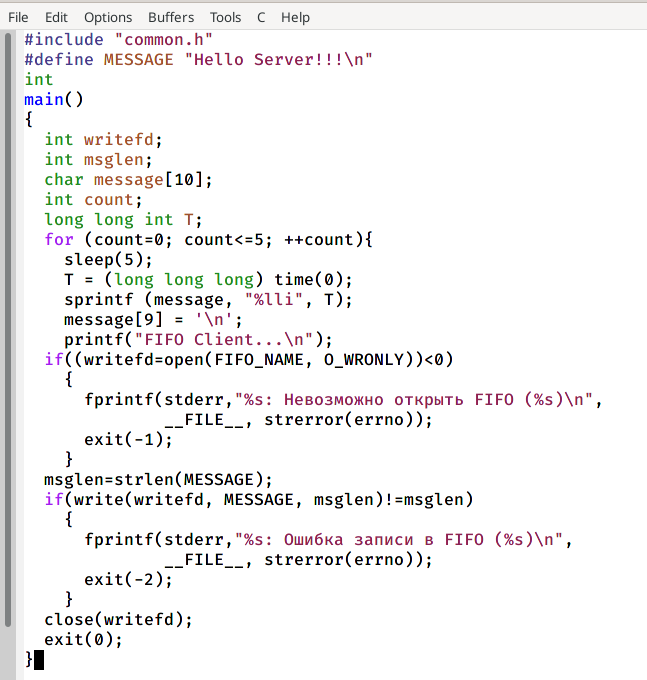
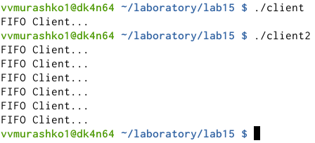
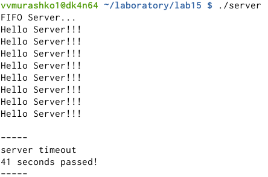

---
## Front matter
lang: ru-RU
title: Именованные каналы
author: Мурашко В.В.
date: 03.06.2021

## Formatting
toc: false
slide_level: 2
theme: metropolis
header-includes: 
 - \metroset{progressbar=frametitle,sectionpage=progressbar,numbering=fraction}
 - '\makeatletter'
 - '\beamer@ignorenonframefalse'
 - '\makeatother'
aspectratio: 43
section-titles: true
---

# Отчёт по лабораторной работе №15

## Цель работы

Приобретение практических навыков работы с именованными каналами.

# Выполнение лабораторной работы

## common.h

{ #fig:001 width=70% }

## server.c

{ #fig:001 width=70% }

## client.c

{ #fig:001 width=70% }

## common.h

{ #fig:001 width=70% }

## server.c

{ #fig:001 width=70% }

## client.c

{ #fig:001 width=70% }

## client2.c

{ #fig:001 width=70% }

## ./client.c и ./client2.c

{ #fig:001 width=70% }

## ./server

{ #fig:001 width=70% }

## Вывод

Я приобрела практические навыки работы с именованными каналами.
